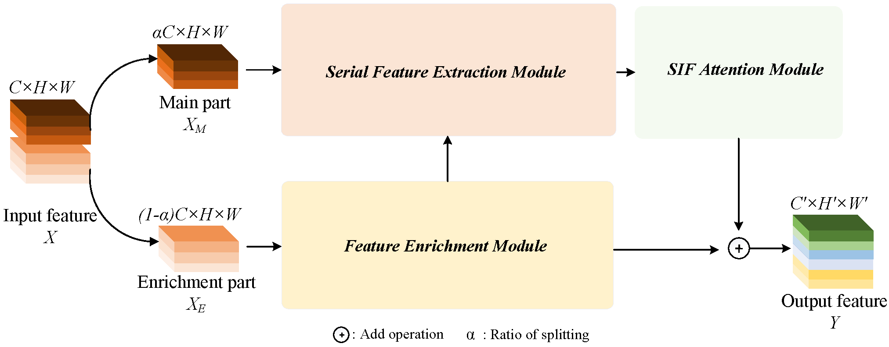

# SSDConv

👨‍🔬 By Huihuang Zhang, Haigen Hu*, Deming Zhou, Bin Cao, Xiaoqin Zhang*

> Designing a compact network with minimal performance degradation offers a promising prospect for limited computational resources. To this end, existing methods commonly focus on simply reducing redundant features from the perspective of feature redundancy rather than feature diversity. In fact, this way does not mean an increase in feature diversity, thereby obtaining a limited performance improvement. To address this issue, we propose **SSDConv** (Similarity attention and Serial Diversity Convolution), a compact convolutional module that enhances feature diversity by exploring inter-channel similarity and redesigning filter deployment. Specifically, feature diversity is improved by guiding filters through similarity attention and utilizing a serial convolution structure to extract multi-scale features. Extensive experiments demonstrate that replacing standard convolutions with SSDConv significantly reduces FLOPs and parameters while achieving superior accuracy on CIFAR-10 (92.67%) and ImageNet (77.07%). It also improves performance in downstream tasks, such as +39.3% mAP on COCO and +3.2% mIoU / +1.4% mAcc on Cityscapes. SSDConv is a plug-and-play module, ready to replace standard convolutions and adaptable to various CNN architectures.

<p align="center">
    
</p>

This repository contains the official PyTorch implementation of **SSDConv** for the TETCI paper [*Feature Diversity Learning for a Compact CNN Module*](https://ieeexplore.ieee.org/document/11010101)).

---

### ⚙️ Environments

```bash
Python:     3.8+  
PyTorch:    1.12.0+  
Torchvision:0.13.0+  
CUDA:       11.3+  
CUDNN:      8.2+  
NumPy:      1.21+  
PIL:        9.0+  
```

---

### 🚀 Usage

SSDConv is designed to **replace standard 3×3 convolutional layers** in CNNs. It is implemented in PyTorch and integrates seamlessly into existing architectures.

📌 **Example**: Replace a standard `nn.Conv2d(64, 128, kernel_size=3, stride=1, padding=1)` with SSDConv:

```python
# Original Conv2d:
# conv = nn.Conv2d(64, 128, kernel_size=3, stride=1, padding=1)

# Replace with SSDConv:
ssd = SSDConv(in_channels=64, out_channels=128, kernel_size=3, stride=1)
out = ssd(input_tensor)
```

📎 **Note**: You can adjust `in_ratio`, `out_ratio`, `exp_times`, and `reduction` to balance performance and efficiency.

---

### 📚 Citation

If you find SSDConv helpful, please consider citing our work:

```bibtex
@article{zhang2025feature,
  title={Feature Diversity Learning for a Compact CNN Module},
  author={Zhang, Huihuang and Hu, Haigen and Zhou, Deming and Cao, Bin and Zhang, Xiaoqin},
  journal={IEEE Transactions on Emerging Topics in Computational Intelligence},
  year={2025},
  publisher={IEEE}
}
```
